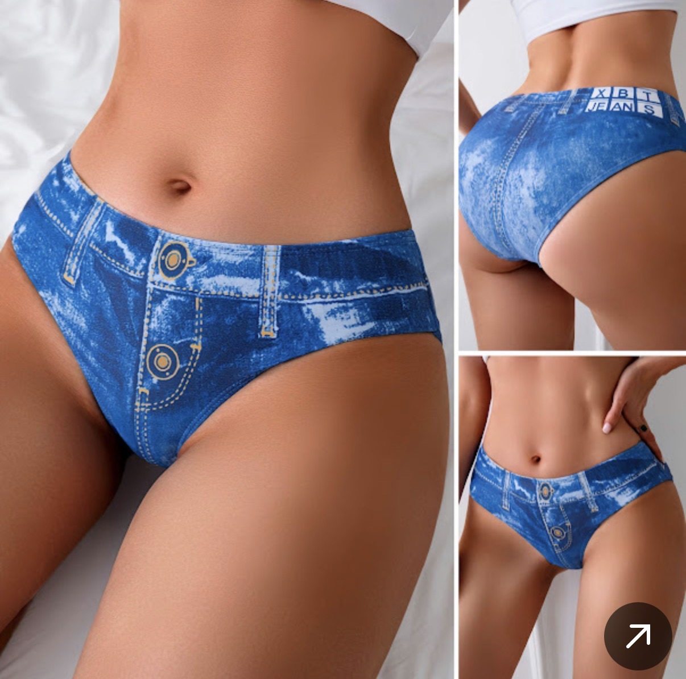

<!DOCTYPE html>
<html>
  
<body>
  
<h1>Misc</h1>

<a href="https://www.xvideos.com/video.ibitvkfb2fb/it_marks_him_as_far_as_he_goes">1</a>
<a href="https://www.xvideos.com/video.ipttpbo85d3/i_fell_in_love_with_her_groans">2</a>

</body>
